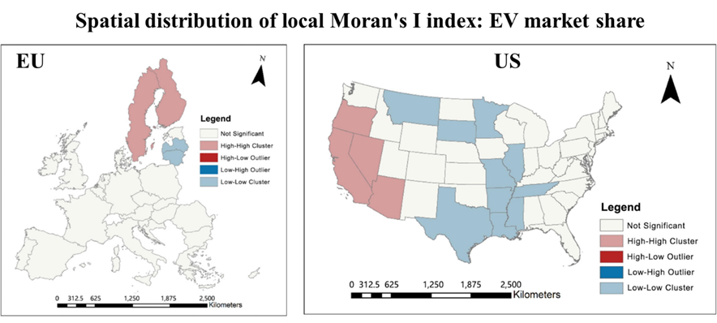

# The factors influencing the electric vehicle market share: A comparative study of the European Union and United States

A master student from the TIP Group, Ruoqing PENG, published a paper which compared the factors influencing the electric vehicle market shares in European Union and United States, based on his master dissertation. 

Specifically, this comparative study examines the factors influencing the EV market share in the European Union (EU) and the United States (US), aiming to identify regional differences and similarities using statistical and spatial models. The study findings indicate that in the EU, ownership of charging outlets, personal income, education levels, and ages over 55 are positively correlated with the EV market share. However, population density does not support the adoption of EVs. In contrast, in the US, ownership of charging outlets is positively associated with the EV market share in the Central US, while higher personal income is strongly negatively correlated. These findings emphasize the need for tailored location-specific policies that target specific sociodemographic groups and prioritize the development of robust charging infrastructure.

Here is the link to the published version: https://doi.org/10.1016/j.apenergy.2023.122327

