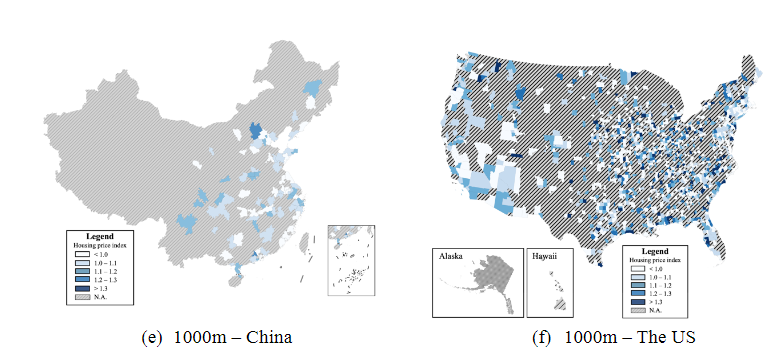

# Maps

<!--  -->

## [Spatial Distributions of EVCSs](./AB.md)
> the spatial distributions of EVCSs across the three study areas.

Interactive Map : [Click Here](./AB.md)

## [Spatial Distributions of the Level of Population Coverage of EVCSs at the City Level](./C.md)

>the spatial distributions of the level of population coverage of EVCSs at the city level across the three study areas. It can be found that, in general, for those cities with more EVCSs, EVCSs tend to be deployed in those areas with a lower population density. 

<!--  -->
Interactive Map : [Click Here](./C.md)

## [Spatial Distributions of the Housing Price Index of EVCSs at the City Level](./D.md)

> the spatial distributions of the housing price index of EVCSs at the city level across the two study areas (i.e., China and the US) and different buffer radii. It can be found that for most cities in both China and the US, the values of housing price index are close to each other (fluctuating around 1), while the US has a wider variation range.

<!--  -->
<!--  -->
Interactive Map : [Click Here](./D.md)

## [Spatial Distributions of the POI Mix of EVCSs at the City Level](./E.md)

> the spatial distributions of POI Mix of EVCSs at the city level across the three study areas and different buffer radii. It can be found that for most cities in the three study areas, they tend to have a high POI Mix of EVCSs, while more cities in the US and Europe tend to have a higher POI Mix of EVCSs compared to China when the buffer radii are 800m and 1000m. 

<!--  -->
<!--  -->
Interactive Map : [Click Here](./E.md)

## [Spatial Distributions of Access to EVCSs through Road Network at the City Level](./F.md)

> the spatial distributions of road network density and the relative development level of road network around EVCSs at the city level across the three study areas and different buffer radii. It can be found that road network density around EVCSs in Chinese cities tend to be lower compared to the US and Europe. Meanwhile, in terms of the relative development level of road network, cities in China and the US tend to have a greater variability compared to Europe.

<!--  -->

Interactive Map : [Click Here](./F.md)